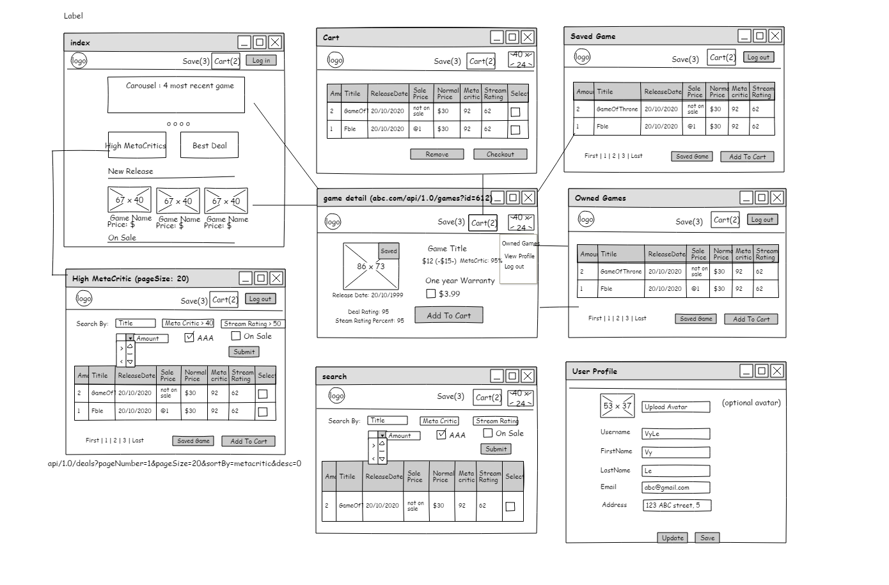
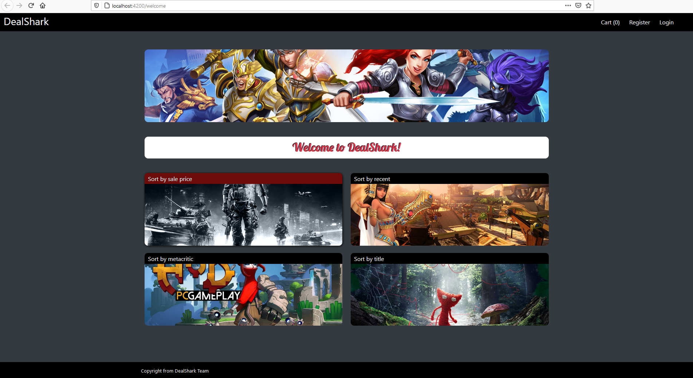
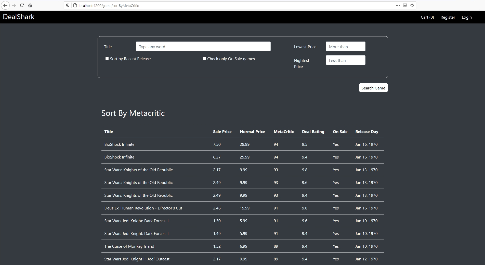
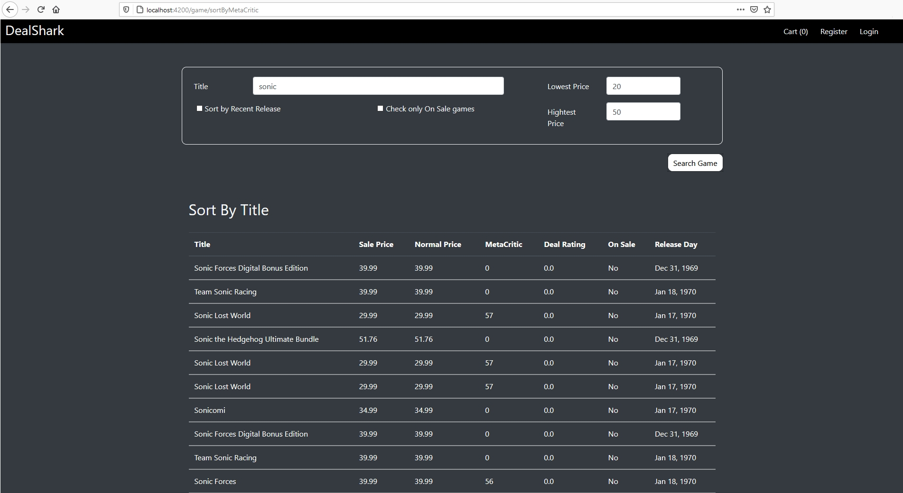
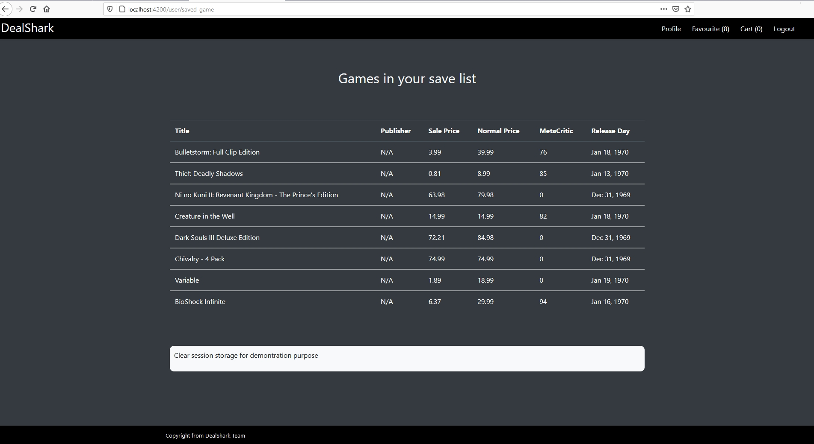
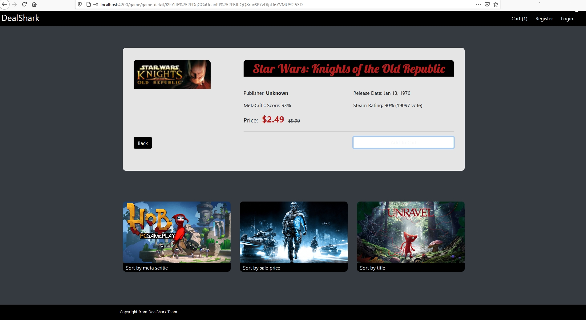
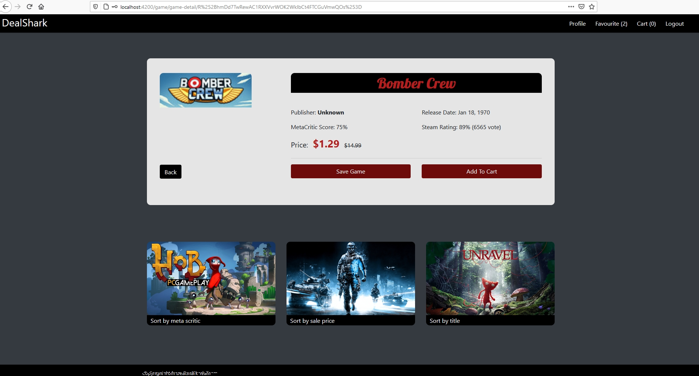
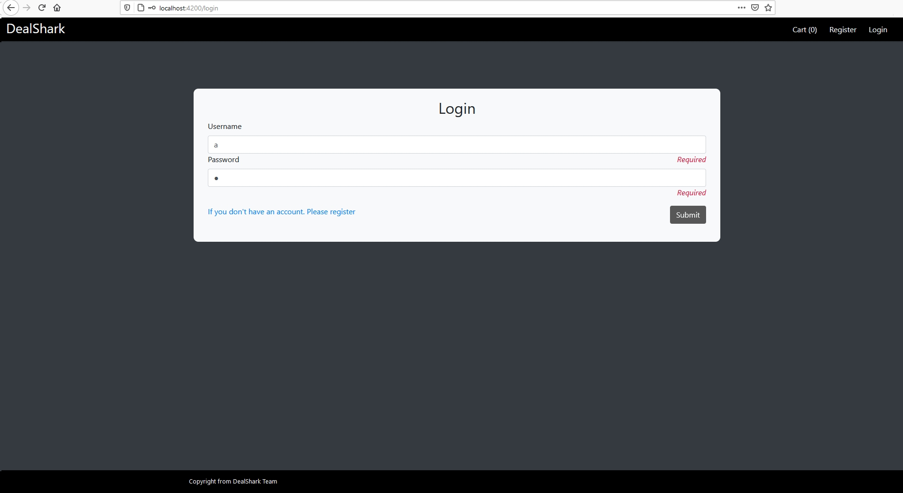
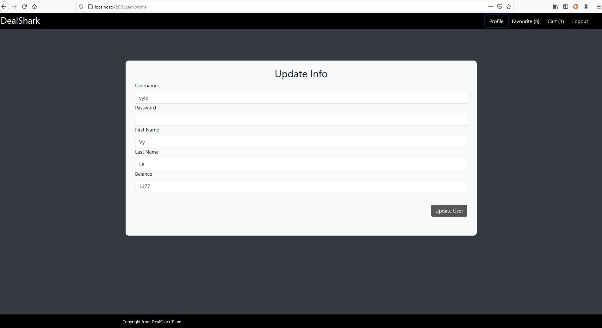
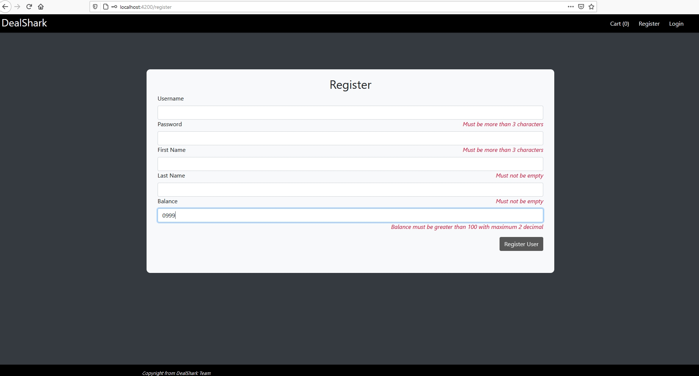

# DealShark

## Note between team members for essential changes/details:

### Sunday March 21:
- I created **lazy loading route** for **game** and **user** in general. To do this, I have to create each one a module so the **structure** had been **change**, as well as **url**.
- Component game list, game detail moved inside game module. Url is game for game list, game/game-detail for game detail (just a placeholder)
- Component profile, owned-game, saved-game also moved to user module, url: user/, user/owned-game, user/saved-game

```
http://localhost:4200/user/owned-game
http://localhost:4200/user (profile)
http://localhost:4200/user/saved-game

game list :sortBy
http://localhost:4200/game/sortByRecent 
http://localhost:4200/game/sortByTitle
http://localhost:4200/game/sortByMetacritic
http://localhost:4200/game/sortByDeal
http://localhost:4200/game/123XMH5JDOIS3POSMJ9EMJ (dealId)
```


Screenshots:
Home Screen when haven't log in

Sort game list by MetaCritic. When clicked on any of the table header, we are able to sort by ascending or descending on title, sale price, release day, metacritic, deal rating inside GameList Component. We can go to its game detail page by click on a row

Filter game list by title Sonic with lowest price 20 and highest price 50

Save Game page. The ids of all the saved game were retrieved when user login. Other data like title, metacritic, release date were retrieved by forkJoin multiple http get request (get by id) and stored inside an array then they were turned to Json and added into session

Game detail when haven't login

Game detail when login

Login page when inputs have been touched and the requirement haven't been met

User profile update when just go to profile page. The submit button is disable for not meeting the requirement

Register page when user just login and hovered around the disabled register button
